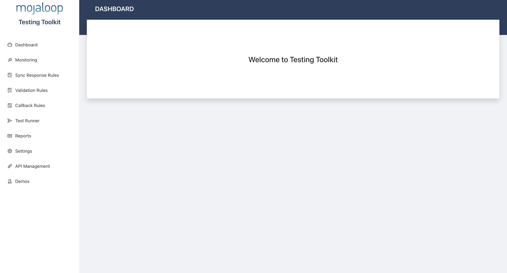
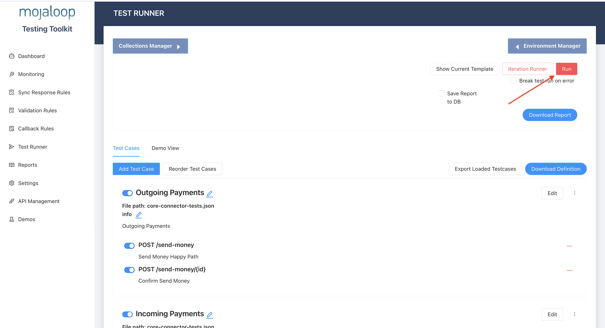

# ML Core Banking System Core Connector Test Harness
A development and testing harness for core connectors that support the P2P cross currency use case in a Mojaloop scheme


# Pre-requisites
Before you go through this test harness documentation, the following are required for you to be able to go through it successfully

- Working knowledge of RESTful APIs
- Docker 

# Overview 
This test harness is intended to provide a core connector testing and development framework. The idea of a core connector came about as a result of the need to have an integration middlewear between the Mojaloop Connector (SDK Scheme Adapter) and a Financial Service Provider (FSP) Core Banking System.

# Developing a Core Connector
To develop a core connector, it is important to understand the different apis that the core connector needs to expose and those it needs to consume to support receipt and initiation of payments in a Mojaloop scheme.

Here is a diagram that illustrates role of a core connector in a typical mojaloop payments scheme


In the illustration, we see the core connector being used as an adaptor between the FSP Core Banking System and the Mojaloop Connector to facilitate payments. 

A core connector is an api server that receives requests from the mojaloop connector and brokers them to your core banking system and vice versa to perform payment operations.

The core connector is supposed to implement and expose two apis for it to be able to effectively support payment operations in a mojaloop scheme.

# Incoming Payments - Payee

Below is an architecture diagram that shows how a core connector supports payee receipt of funds from a mojaloop scheme.


In this architecture the core connector is shown as a stateless synchronous api that supports the crediting of funds into an beneficiaries account.

The Mojaloop connector and the switch are simulated using TTK. To support incoming transactions, the core connector should implement the backend api for the Mojaloop connector.

Please find the api schema for the mojaloop connector backend api at the this location

```bash
./resources/api-spec/payee.yaml
```

Here is a [link](./resources/api-spec/payee.yaml) to the api schema file

When an inbound payment is received by the  mojaloop connector, it will make requests to your core connector to perform account lookup, quoting and effecting transfers.

The core connector needs to respond to the api calls described in the open api specification for payee.

# Outgoing Payments - Payer
Here is another illustration that shows how the core connector should be used to support out going payments i.e Payments that are initiated fron your financial service provider's customers.


In this architecture, the core connector is shown as a stateless synchronous api that brokers initiation of payments through the mojaloop connector.

To initiate payments to a beneficiary whose account is held in another financial service provider, the core connector would need to make requests to the outbound api of the mojaloop connector.

Please find the api schema for the mojaloop connector outgoing api at the this location

```bash
./resources/api-spec/payer.yaml
```

Here is a [link](./resources/api-spec/payer.yaml) to the api schema file

To have a fully functioning core connector, it needs to implement both apis for handling incoming payments and initiating outgoing payments.

Here is an architecture to illustrate how all the different apis line up in the integration setup.


When building your core connector, to support testing, please expose the server to listen on port 3003 because it is on this port that requests will be made to validated the test cases.

If you have environment variables for the core connector, place them in a .env file such that when it comes to time for executing test cases, you will overwrite the contents of the .env.example file of this folder with your environment variables. 

# Setup

Once you have developed the core connector, it will need to be tested to verify that it responds accordingly to all happy paths and exception cases.

To test your core connector, you will need to package it as a docker image using a [Dockerfile](https://docs.docker.com/reference/dockerfile/)

Build your core connector docker image and tag it with the name in the command. You can build like so.

```bash
docker build -t cbs-core-connector:local . 
```
When you run the test harness using docker compose, it will be able to pick up the built docker image and run it as part of the test stack.

To run the test harness use this command to clone this repository. 

```bash
git clone https://github.com/mojaloop/CbsCoreConnectorTestHarness.git
```
After cloning this repository, navigate into the directory to set up the tests.

```bash
cd CbsCoreConnectorTestHarness
```
Copy the contents of the environment file you created if any to the .env.example file in this folder


Run this command to bootstrap the test harness on your local machine.

```bash
docker compose up 
```
You could also choose to run it in detached mode by adding the `-d` option.

```bash
docker compose up -d
```

After bootstraping the test harness, you are ready to start running tests against your core connector.


# Running Tests
To run the tests, you will need to open the TTK UI in your web browser.
TTK is deployed as part of the test harness.

Follow this link to open the TTK Ui. http://localhost:6060


Once you open this link, you will be brought to this interface as shown in this screenshot


Click on Test Runner 


In the right hand upper corner click the Run button to execute test cases against your core connector.



After executing the tests, you will see the test results which will show how many tests passed or failed.

# Conclusion

This test harness is intended to support the development and testing of core banking solution core connectors for a mojaloop.

Note that it is important to implement the api schemas correctly because the api schemas are the ones against which test  case assertions will be executed.

